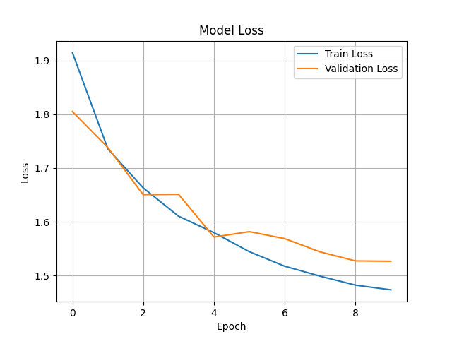

# 🖼️ CIFAR-10 Image Classification  

A deep learning project that classifies images from the **CIFAR-10** dataset using a **Multilayer Perceptron (MLP)** implemented with TensorFlow and Keras.  
The model is trained on 60,000 color images (32×32×3) across 10 object categories such as airplanes, cars, birds, and ships.

---

## 📖 Overview  

This project demonstrates how to recognize everyday objects using a fully connected neural network trained on the **CIFAR-10** dataset.  
Although **Convolutional Neural Networks (CNNs)** usually perform better for image data, this implementation shows how even a simple **feed-forward MLP** can learn basic visual patterns.  

It serves as an educational baseline for beginners exploring deep learning and computer vision with TensorFlow.

---

## 🌐 Dataset  

The **CIFAR-10** dataset contains small RGB images classified into 10 categories:

| Class | Label |
|:------|:------|
| 0 | airplane |
| 1 | automobile |
| 2 | bird |
| 3 | cat |
| 4 | deer |
| 5 | dog |
| 6 | frog |
| 7 | horse |
| 8 | ship |
| 9 | truck |

- **Training samples:** 50,000  
- **Testing samples:** 10,000  
- **Image size:** 32×32 pixels, 3 color channels  

The dataset is automatically downloaded from the `tensorflow.keras.datasets` module.

---

## 🧠 Model Architecture  

The model is a **fully connected neural network (MLP)** built using Keras’ Sequential API.  
Each 32×32×3 image is flattened into a 3072-dimensional vector and passed through dense layers for classification.

```python
model = tf.keras.models.Sequential([
    tf.keras.layers.Dense(128, activation='relu', input_shape=(3072,)),
    tf.keras.layers.Dense(64, activation='relu'),
    tf.keras.layers.Dense(10, activation='softmax')
])
```
**Model Summary**  
- Input layer: Flattened 3072-element vector (32×32×3)  
- Hidden layers: Dense(128, ReLU) → Dense(64, ReLU)  
- Output layer: Dense(10, Softmax)  
- Loss: `sparse_categorical_crossentropy`  
- Optimizer: `Adam`  
- Metric: `accuracy`

---

## ⚙️ Installation  

To run this project locally, clone the repository and install dependencies:

```bash
git clone https://github.com/Annjnk/CIFAR-10.git
cd CIFAR-10
pip install -r requirements.txt
```
Or manually install:
```bash
pip install tensorflow numpy matplotlib scikit-learn
```

## 🚀 How to Run
Launch Jupyter Notebook or VS Code.
Open the file:
cifar_train.ipynb
Run all cells sequentially to:
Load and preprocess the CIFAR-10 dataset
Train the neural network
Evaluate performance and visualize results

## 📈 Training & Results
Training accuracy: ~45–50%
Testing accuracy: ~47%
Epochs: 10
Batch size: 64
Example output:
Epoch 10/10
loss: 1.45 - accuracy: 0.4750 - val_accuracy: 0.4600

## 📊 Accuracy and Loss Curves
You can visualize the training process with:
```bash
plt.plot(history.history['accuracy'], label='Train Accuracy')
plt.plot(history.history['val_accuracy'], label='Validation Accuracy')
plt.legend()
plt.show()
```



## 🖼️ Visual Samples
Example CIFAR-10 images (32×32 color):
✈️ Airplane
🚗 Automobile
🐦 Bird
🐱 Cat
🐸 Frog


These samples illustrate the dataset’s diversity and the challenge of distinguishing small, low-resolution images.


## 🧩 Future Improvements
Replace the MLP with a Convolutional Neural Network (CNN)
Add data augmentation for better generalization
Experiment with dropout and batch normalization
Implement real-time image prediction using webcam input
Build a simple web interface (Flask or Streamlit)

## 📚 References
CIFAR-10 Dataset – TensorFlow Documentation
Keras API Reference
Deep Learning with Python – François Chollet


